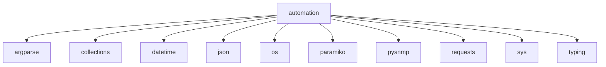

# Imports

[← Back to MODULE](MODULE.md) | [← Back to INDEX](../../INDEX.md)

## Dependency Graph

## Internal Dependencies

Dependencies within this module:

- `re`

## External Dependencies

Dependencies from other modules:

- `argparse`
- `collections`
- `datetime`
- `json`
- `os`
- `paramiko`
- `pysnmp`
- `requests`
- `sys`
- `typing`

